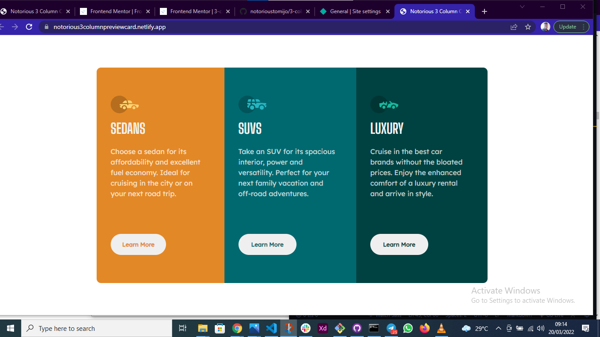

# Frontend Mentor - 3-column preview card component solution

Whatup... this is my solution to the 3-column preview card component challenge on Frontend Mentor(https://www.frontendmentor.io/challenges/3column-preview-card-component-pH92eAR2-). 

## Table of contents

- [Overview](#overview)
  - [The challenge](#the-challenge)
  - [Screenshot](#screenshot)
  - [Links](#links)
- [My process](#my-process)
  - [Built with](#built-with)
  - [What I learned](#what-i-learned)
  - [Continued development](#continued-development)
- [Author](#author)

## Overview

### The challenge

Users should be able to:

- View the optimal layout depending on their device's screen size
- See hover states for interactive elements

### Screenshot

### Links

- Solution URL: https://www.frontendmentor.io/solutions/3-column-preview-card-component-built-with-html-and-scss-zkoA9ww4q
- Live Site URL: https://notorious3columnpreviewcard.netlify.app/

## My process

### Built with

- Semantic HTML5 markup
- SCSS
- Flexbox
- CSS Grid

### What I learned

I learnt that sometimes, way too many styles spoil the code. And no, I will not explain further. But think about it. Sometimes, mean lean code can get the job done. In fact, I think that should be the goal.

### Continued development

Of course, I'm gonna keep grinding with HTML and SCSS till I get great at it. I also plan on getting back on my Javascript lessons.

## Author

- Website - Tomi Joshua (www.linkedin.com/in/tomi-joshua)
- Frontend Mentor - [@notorioustomijo](https://www.frontendmentor.io/profile/notorioustomijo)
- Twitter - [@notorioustomijo](https://www.twitter.com/notorioustomijo)

